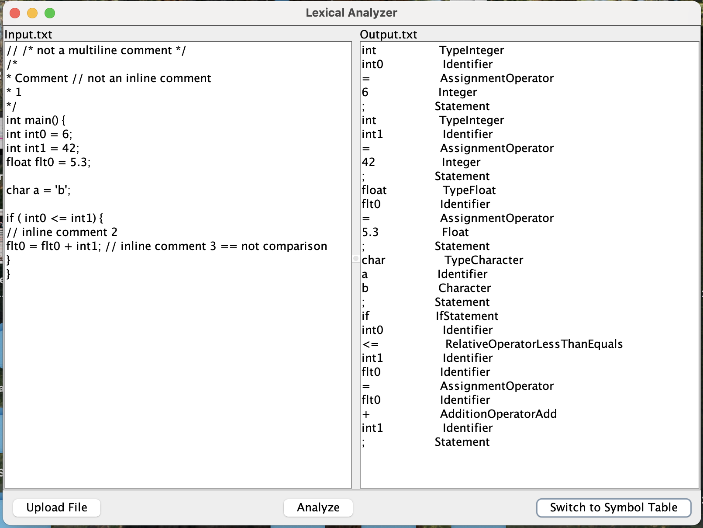

CLite Lexical Analyzer built for COP 4555 (Principles of Programming Langs) using Swing

Very basic, but fully functional. Feel free to build upon it, or refer to it as an example.  

If this does help consider staring the repo so that more people can find this example in the future 😊

---

---

Instructions:  
clone the repo in terminal: `git clone https://github.com/hpitta26/lexical-analyzer.git`
compile example: `javac MainUpload.java`  
move decompiled files: `./move_decompiled.sh`  
run example: `java -cp decompiled MainUpload.java`  